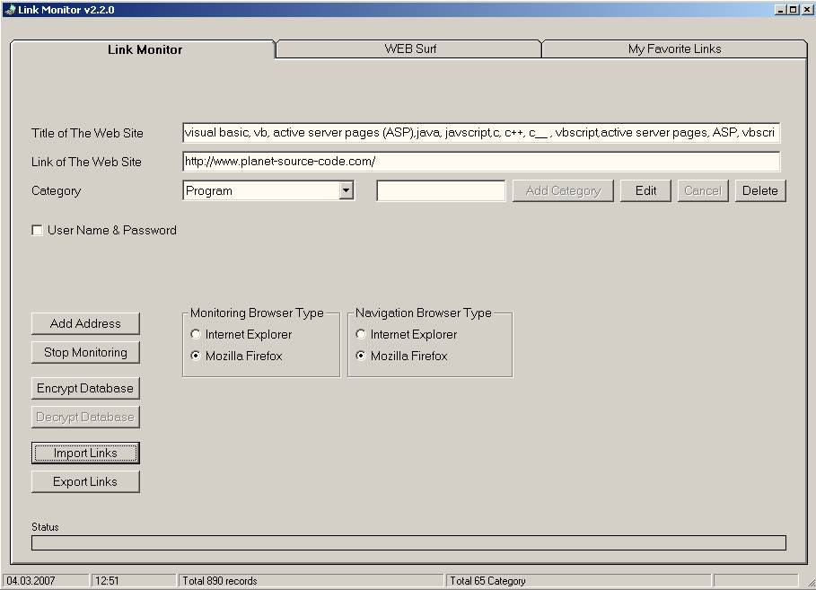



## Link Monitor

### Description

This program monitors internet browsers and extracts current web addresses from them by DDE (dynamic data exchange) technology. It's now in version 2.2.

Importing &amp; exporting saved link feature has been added.
 
### More Info
 

             |
---                |---
**Submitted On**   |2007-02-25 21:23:46
**By**             |[Ferhat Nutku](https://github.com/Planet-Source-Code/PSCIndex/blob/master/ByAuthor/ferhat-nutku.md)
**Level**          |Intermediate
**User Rating**    |5.0 (15 globes from 3 users)
**Compatibility**  |VB 6\.0
**Category**       |[DDE](https://github.com/Planet-Source-Code/PSCIndex/blob/master/ByCategory/dde__1-28.md)
**World**          |[Visual Basic](https://github.com/Planet-Source-Code/PSCIndex/blob/master/ByWorld/visual-basic.md)
**Archive File**   |[Link\_Monit205120322007\.zip](https://github.com/Planet-Source-Code/ferhat-nutku-link-monitor__1-66052/archive/master.zip)

